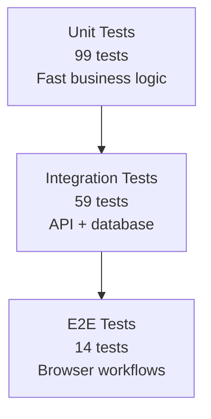
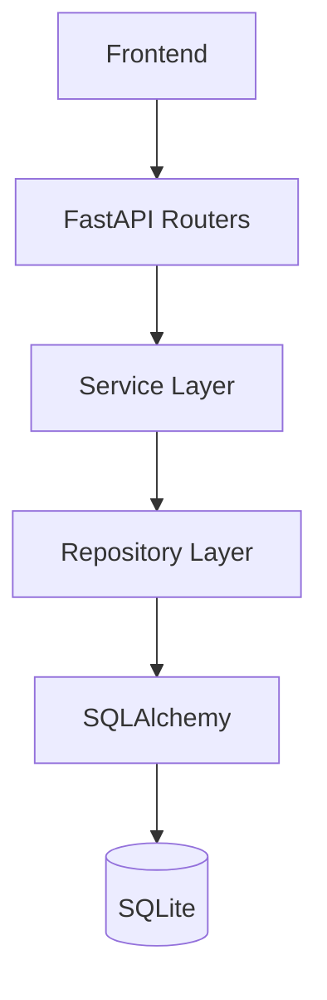
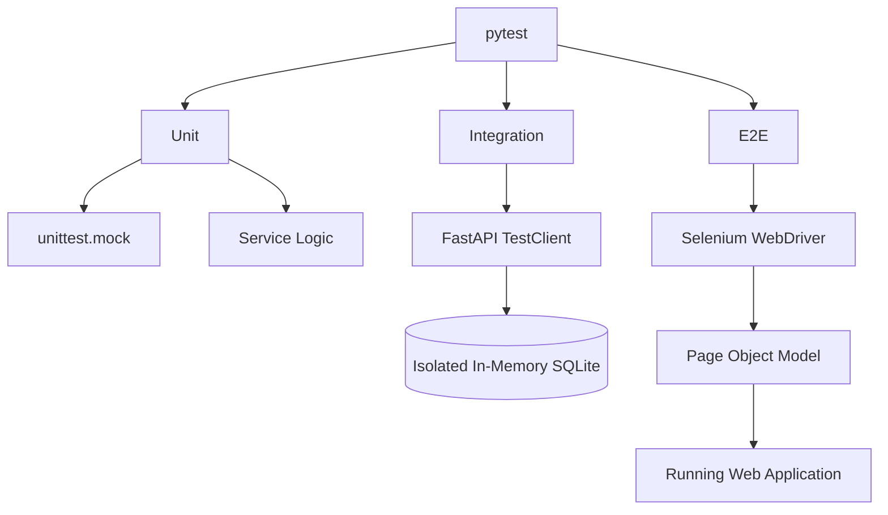
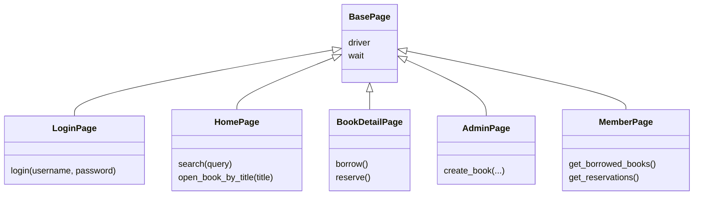

# Testing Strategy and Architecture

## 1. System Under Test

The library management application provides authentication, catalog management, borrowing, returning, reservations, and role-based access control. The application is treated as the **System Under Test**.

The automated testing framework is evaluated by how effectively it verifies these behaviors at different abstraction levels.

## 2. Test Pyramid

The project deliberately keeps E2E coverage smaller because browser tests are slower and more environment-dependent.

## 3. Application Architecture

## 4. Testing Architecture

## 5. Test-Level Responsibilities

| Level | What it verifies | Main tools |
|---|---|---|
| Unit | Business rules, validation, edge cases | pytest, unittest.mock |
| Integration | API contracts, authentication, authorization, persistence | pytest, TestClient, SQLAlchemy, SQLite |
| E2E | Critical real-user workflows | Selenium, Page Object Model |

## 6. Test Design Techniques

### Equivalence Partitioning

Inputs are divided into meaningful classes, such as valid/invalid users or books with/without available copies.

### Boundary Value Analysis

Important boundaries are tested explicitly, including borrowing limits and fine thresholds.

### Negative Testing

Invalid credentials, missing resources, unavailable books, inactive members, and unauthorized roles are tested.

### Regression Testing

Previously discovered behavior is protected by a dedicated regression test so that a future code change cannot silently reintroduce the defect.

## 7. Test Data Strategy

Factory Boy and Faker create realistic entities for tests. Factories remain independent from the application database, while integration fixtures control database lifecycle and isolation.

## 8. Integration Isolation

Integration tests use an in-memory SQLite database with a controlled SQLAlchemy connection and transaction lifecycle. This prevents tests from depending on a developer's local database and makes test order less significant.

## 9. E2E Page Object Model

The POM keeps selectors and browser interactions out of the high-level test scenarios.

## 10. Current Coverage Matrix

| Feature | Unit | Integration | E2E |
|---|:---:|:---:|:---:|
| Authentication | ✓ | ✓ | ✓ |
| Book search | ✓ | ✓ | ✓ |
| Book details | ✓ | ✓ | ✓ |
| Borrowing | ✓ | ✓ | ✓ |
| Reservations | ✓ | ✓ | ✓ |
| Authorization/RBAC | ✓ | ✓ | ✓ |
| Book management | ✓ | ✓ | ✓ |
| Fine calculation | ✓ | ✓ | — |
| Factory/test-data infrastructure | ✓ | ✓ | — |

Only behaviors actually represented by the current source should be presented as covered.

## 11. Known Limitations

- E2E tests require the frontend/backend and a compatible browser to be running.
- Mobile/responsive behavior is not systematically automated.
- Performance/load testing is outside scope.
- Full accessibility evaluation is outside scope.
- Concurrent borrowing/race conditions are not covered.

## 12. UML Diagram Sources

Rendered diagrams are provided in `docs/diagrams/` together with PlantUML source files. The source files make the diagrams reproducible and editable rather than treating the images as one-off screenshots.

- `use-case.puml` / `use-case.svg`
- `architecture.puml` / `architecture.svg`
- `testing-architecture.puml` / `testing-architecture.svg`
